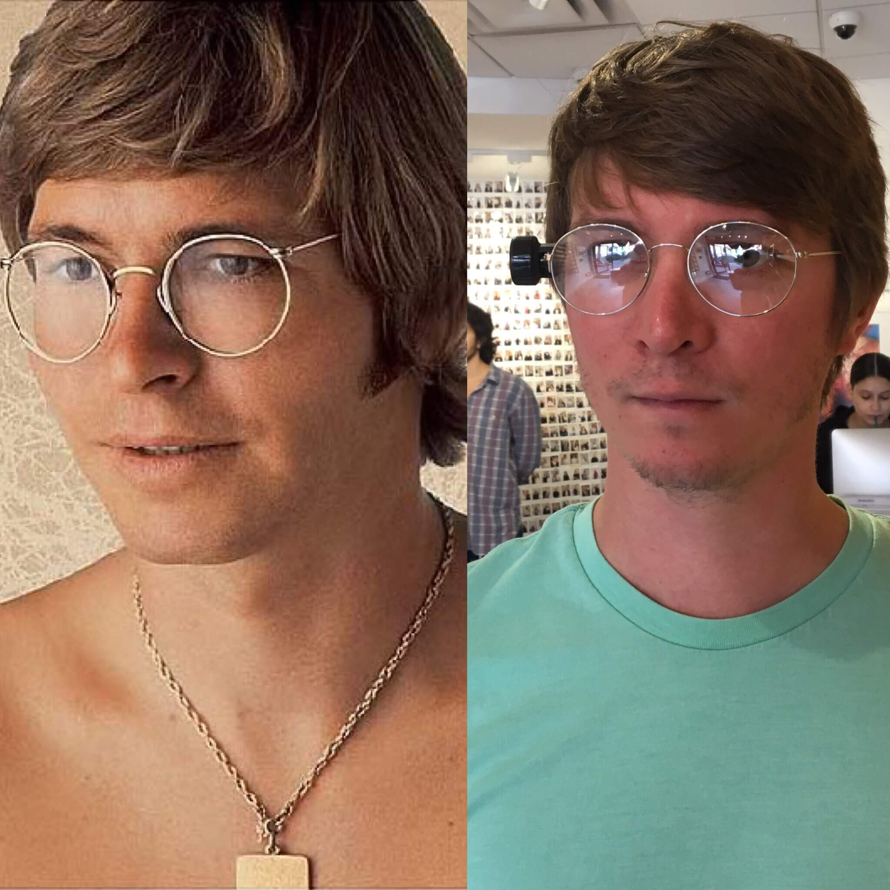
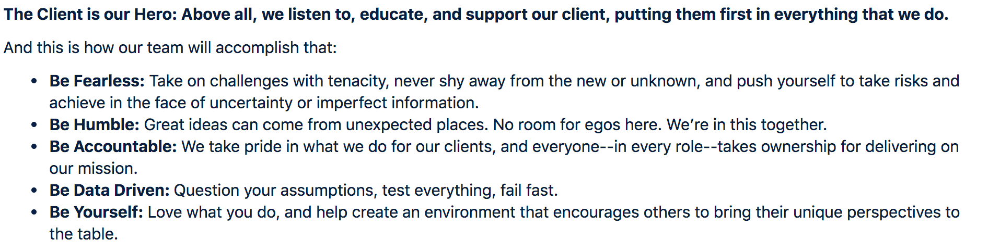
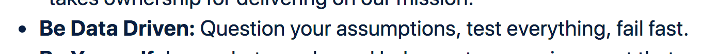
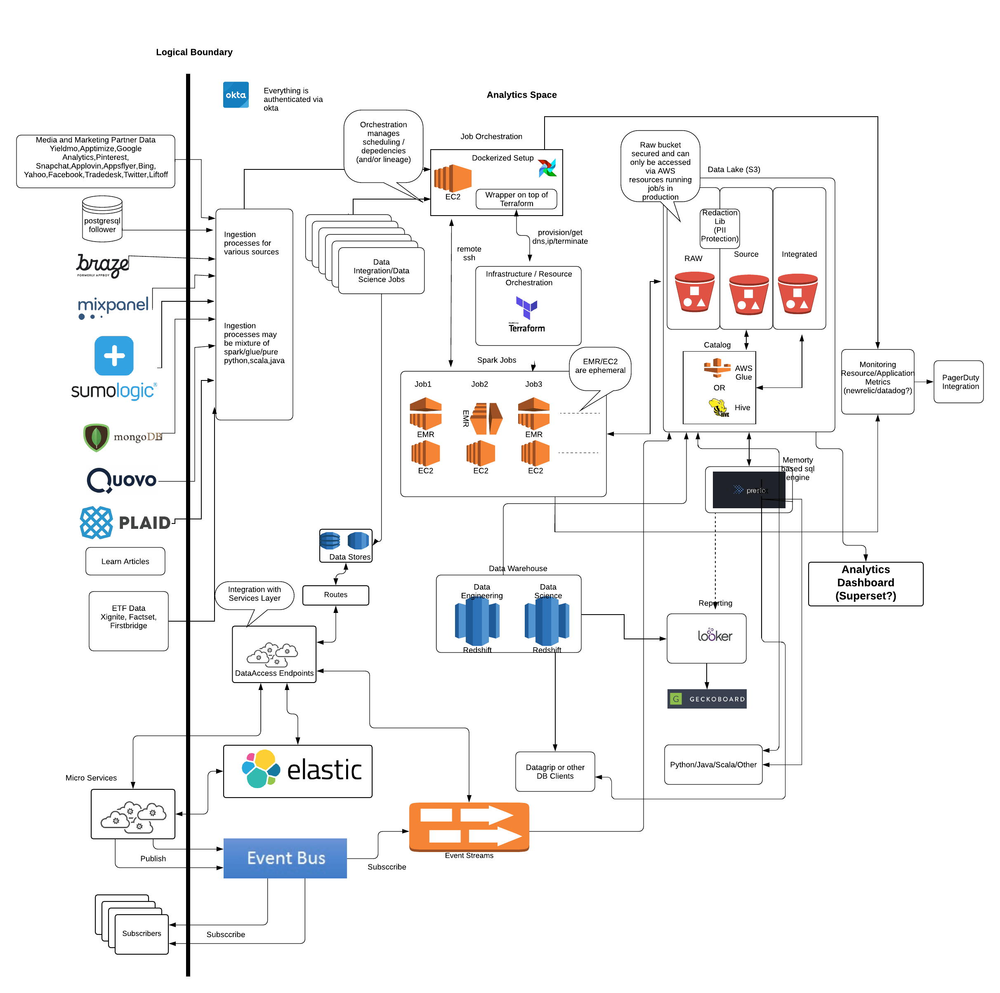
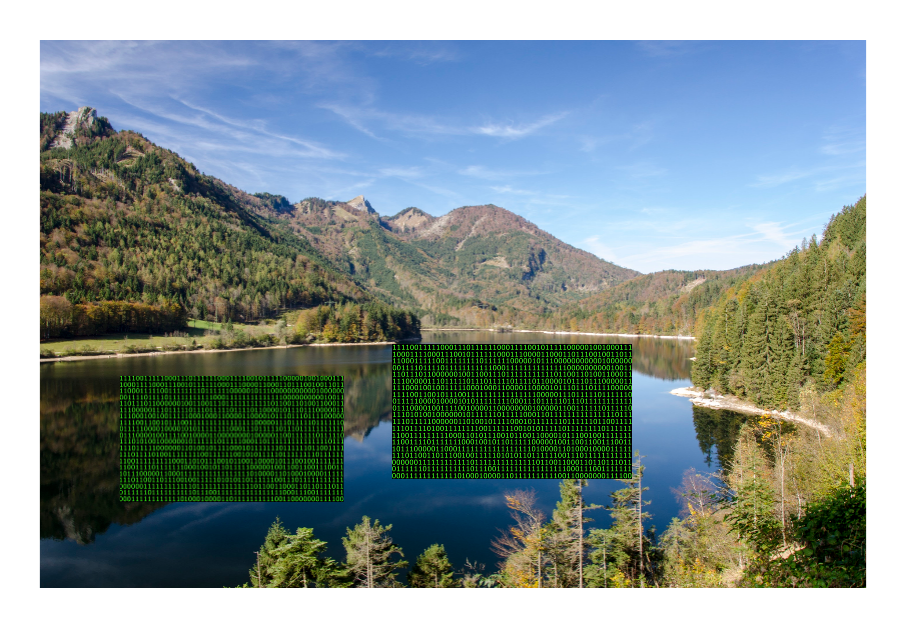
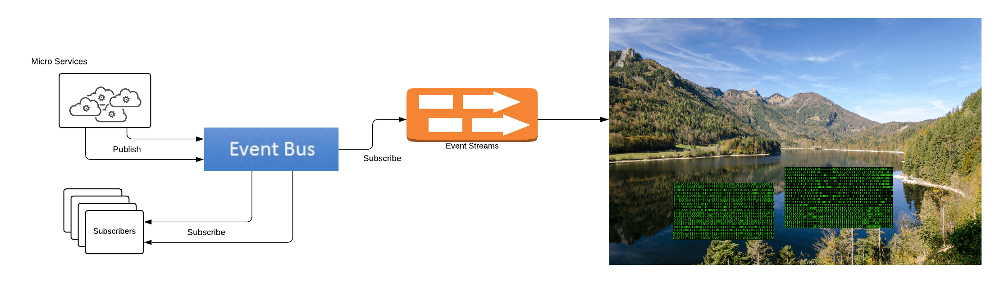
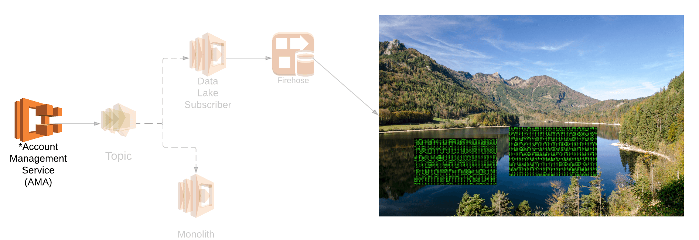
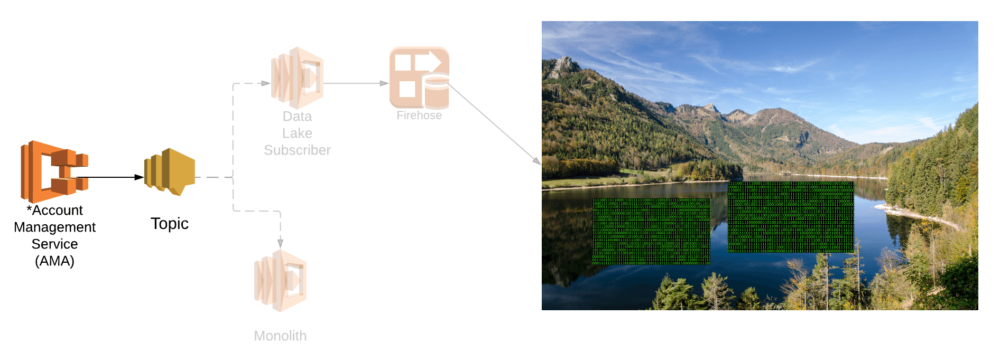
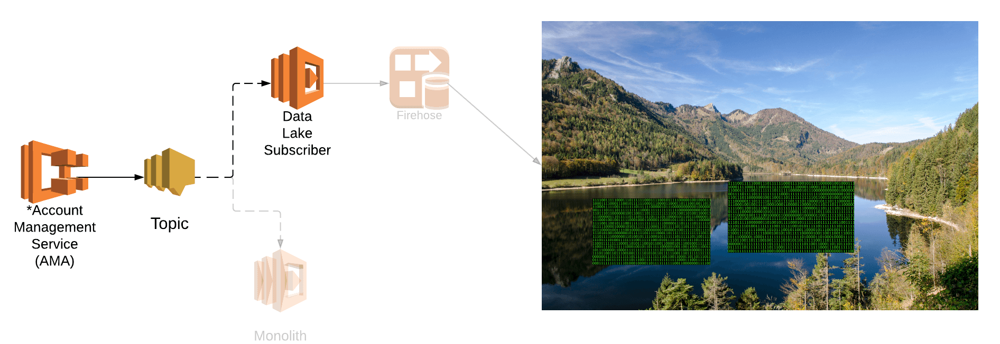
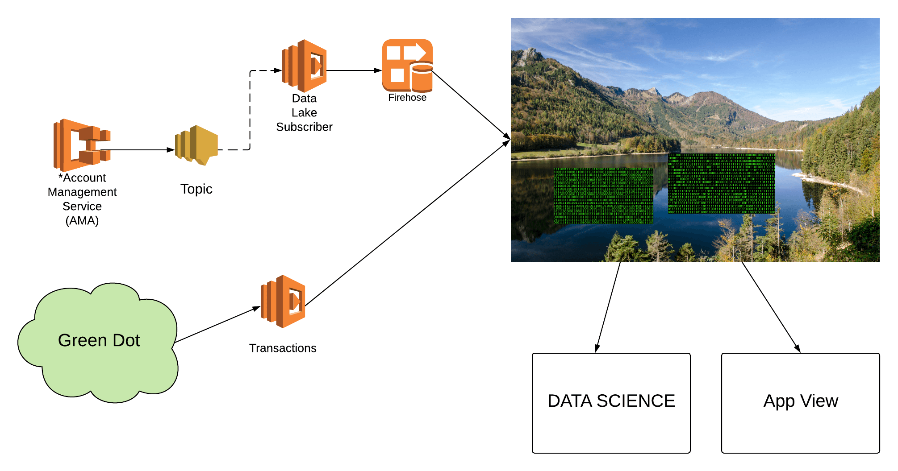

# Waves + Current
@size[50%](Waves don't die. Let me crash here for the moment)

---

@snap[east]
```json
{
  "eventType": "checkingBalanceUpdate",
  "brazeType": "attribute",
  "brazeConfig": {
    "paths": [
      {
        "key": "bank_debit_balance",
        "path": "data/availableBalance"
      },
      {
        "key": "bank_debit_balance_as_of_date_time",
        "path": "data/availableBalanceAsOfDateTime"
      }
    ]
  }
}
```
@snapend

@snap[west]
```json
{
  "id": "0dfdb3d3-0ce2-47f4-899e-9a01cd52c9a1",
  "data": {
    "accountUUID": "988b9b4d-6f6e-45a8-bcf4-7fc1192603a0",
    "ledgerBalance": 129.9,
    "availableBalance": 37.36,
    "ledgerBalanceAsOfDateTime": "2018-12-18T03:00:00.000Z",
    "availableBalanceAsOfDateTime": "2018-12-20T01:51:43.713Z"
  },
  "type": "checkingBalanceUpdate",
  "userUUID": "98d325d5-307f-433f-be33-65f05d04783e",
  "publishedAt": "2018-12-20T01:51:45.539Z"
}
```
@snapend

---?image=assets/gifs/charlie.gif
---?image=assets/gifs/ballmer.gif
---?image=assets/gifs/charlie.gif
---?image=assets/gifs/ballmer.gif
---

## Darion Miller or John Denver?

---

## DM or JD?

---

@snap[west]

@snapend

@snap[east]
@size[1.5em](Darion Miller)
@snapend
---

## DM or JD?

---

@snap[west]

@snapend

@snap[east]
@size[1.5em](Darion Miller)
@snapend
---

## DM or JD?

---

@snap[west]

@snapend

@snap[east]
@size[1.5em](Darion Miller)
@snapend
---

## Agenda

* Data

* Bank platform

---?image=assets/gifs/charlie.gif
---

## Data
---


---


---


---


---

## Data LAKE

---

### ITS A LAKE... OF Data


@ul
- @size[65%](centralizes all of our data)
- @size[65%](mixpanel, braze, plaid, green dot, backend events)
- @size[65%](use case driven views)
@ulend

---?image=assets/gifs/ballmer.gif
---

## DM or JD?

---

@snap[west]

@snapend

@snap[east]
@size[1.5em](John Denver)
@snapend
---

## DM or JD?

---

@snap[west]

@snapend

@snap[east]
@size[1.5em](John Denver)
@snapend

---?image=assets/gifs/charlie.gif
---

## Bank Platform

@ul
- Green Dot ✅
- We're not really the source of truth for anything
- API Calls + Events
@ulend
---

### Service View

---

### Webhooks

---


---


---


---

---

---

---


---?image=assets/gifs/ballmer.gif
---

## DM or JD?

---

@snap[west]

@snapend

@snap[east]
@size[1.5em](Darion Miller)
@snapend
---

## DM or JD?

---

@snap[west]

@snapend

@snap[east]
@size[1.5em](Darion Miller)
@snapend
---

## Questions

😬
